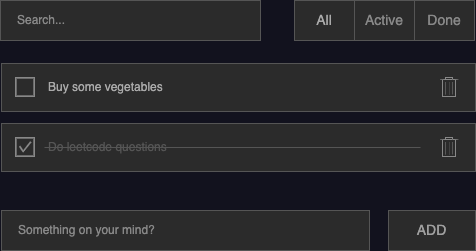

# To-do Lists

Maybe one day I'll want to learn a new programming language or a new framework, and I think implementing a to-do list using that technology will be beneficial.

## Spec

Please refer to `/docs`.

## Front End

## Back End

